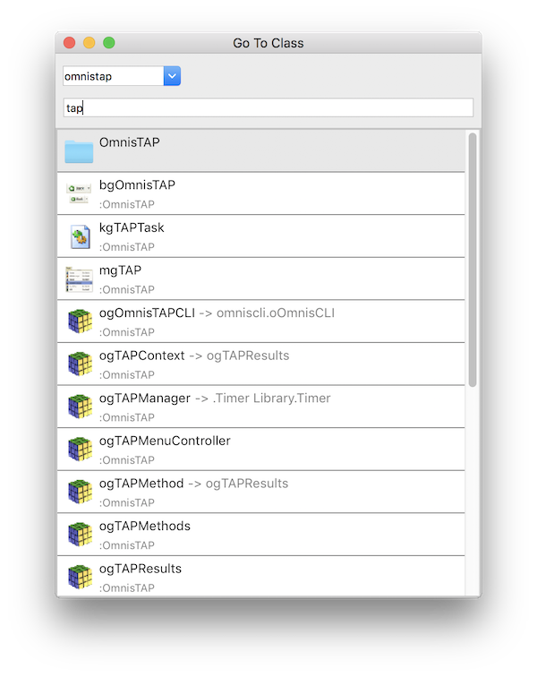

# go-to-class
A utility for quickly opening Omnis windows.

## Installation
1. Download `lib/go_to_class.lbs`
1. Drop in your `startup` folder

## Usage
1. Go to **Tools** -> **Add-Ons** -> **Go to Class...** or use the `command-g` or `ctrl-g` keyboard shortcut
1. Select your library
1. Type to find your classes
1. Classes will be matched by names containing your search text
1. Press F3 to modify the class or F8 to modify the methods

## Contributing
Please see our [guide to contributing](https://github.com/suransys/contributing).
