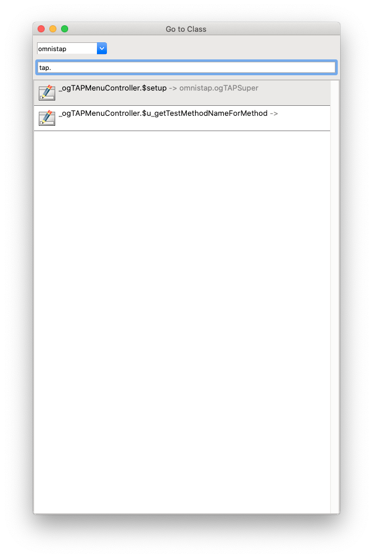

# go-to-class
A utility for quickly opening Omnis classes and methods.

## Installation
1. Download `lib/go_to_class.lbs`
1. Drop in your `startup` folder

## Usage
1. Go to **Tools** -> **Add-Ons** -> **Go to Class...** or use the `command-g` or `ctrl-g` keyboard shortcut
1. Select your library
1. Type to find your classes
1. Classes will be matched by names containing your search text
1. Press F3 to modify the class or F8 to modify the methods

## Futher usage instructions
The class name search is a fuzzy search. Which means that you can type any part of the class to get a result. Begin to type a part of a classname. If the wanted class is  in the list. Several thins can be done:
* *Doubleclick* - Opens de method editor if it is a object or a window class
* After selecting the class or when it is the first one: 
** Press the key *F3* opens the window of a file, query, schema, search, systemtable or window class or if it is a object class it opens the method editor.
** Press the key *F8* the same as F3 except for window classes it opens the method editor
** Press *Enter/Return* has the same functionality as F8.
** or finish typing the name of the class and start searching for a method name in the class. See more info below

### Searching for methods
Searching for methods starts after the input of a dot (.), eg myClass. Result is that all the methods are shown in the list. The method search is fuzzy so you can either type the fullname or any part of it. Removing the method part and the dot returns to searching for a class name.

## Known issues
* If a 'method' search has been done and the dot has been deleted. The result list becomes empty another backspace makes the searching startup again. 

## Contributing
Please see our [guide to contributing](https://github.com/suransys/contributing).
